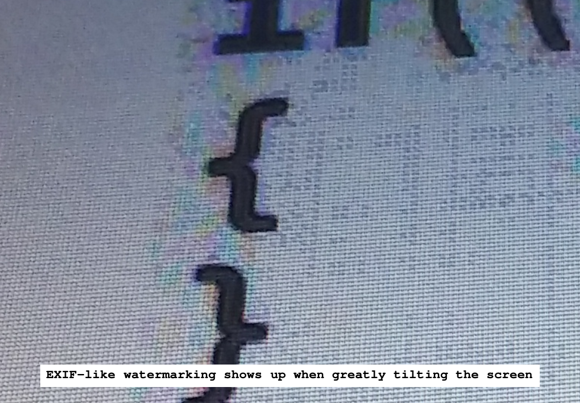

Overkillographic.cpp

 
 

### Photo of a suspicious screenshot

  

 
 

### Copyright & licenses

By law, everything you do, automatically includes the license "all rights reserved".
That's copyright. It means you can sue someone for having the same thoughts.
But you can override this by including any license, such as the Unlicense.

Most github repos have licenses with conditions,
where if you took even a few lines of their code,
you must forever keep visiting their repo, downloading
their updated copyright notices, licenses, and names, and keep
including them in each and every one of your projects
containing those few lines of code.
But still many repos are licensed under the Unlicense,
which has no conditions, and you can look through those repos
without the fear of being forever chained to a human and
its words, words enforced by handcuffs and prison time.

 
 

### Clean Room Reverse Engineering (CRRE)

Let's say you built something and it has a restrictive license, but someone wants to free your code.
* Person A reads your code and writes a description. (Dirty room).
* Person B reads that description and writes unique code. (Clean room).
* Person B can license their code under anything, such as the Unlicense.
* Person B can't sue you for having a copy of your own code.
* And most importantly, you can't sue person B for having a copy of THEIR own code.
* Unless patents, person B created a functionally identical, unrestricted version for all to enjoy.

 
 

### Two is one, and one is none

I have 9 USB sticks held together by one of those rock-climbing things you're
not supposed to climb with. Each stick has its purpose. But 2 of them serve as
backups where I keep saving all my stuff.
They're identical. What I do to 1, I do to the other. See, if I had only one,
and it dies, then I have none. But I have 2. Now if 1 dies, I still have 1,
rather than none.
Create folders like 2026_06_25 and save your stuff in there for that day so you
can retain the stuff before that too, like 2026_06_20.
